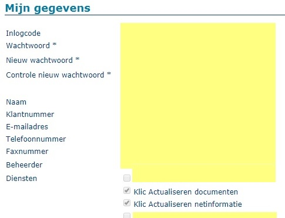
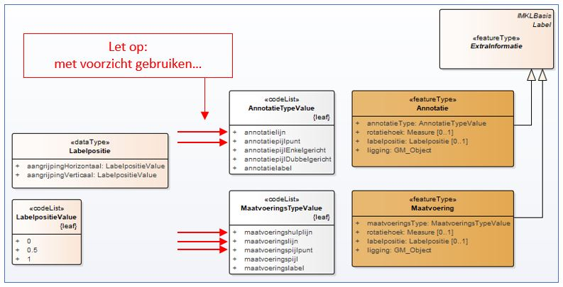
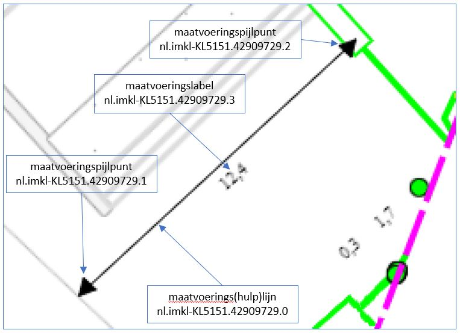
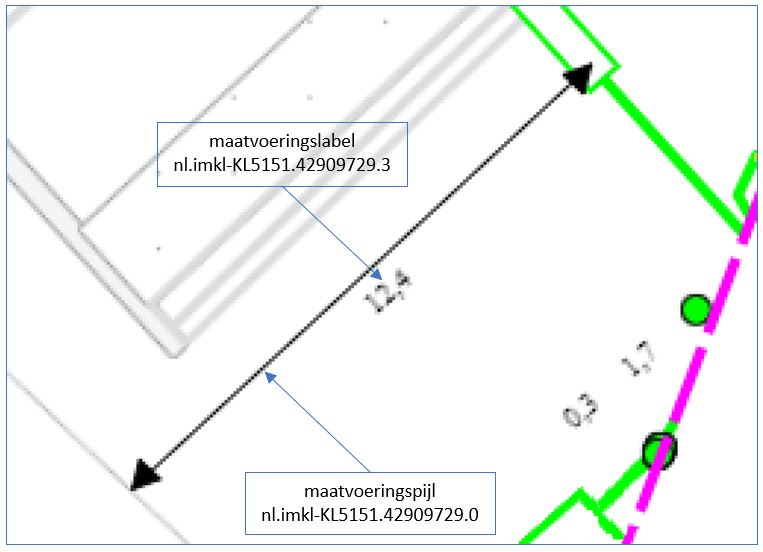
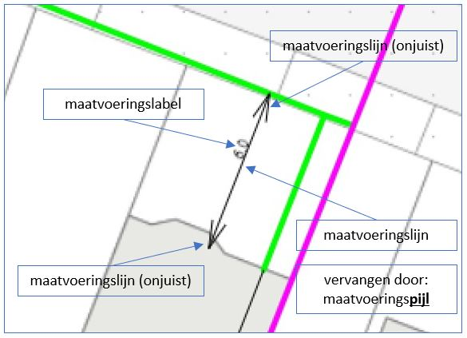
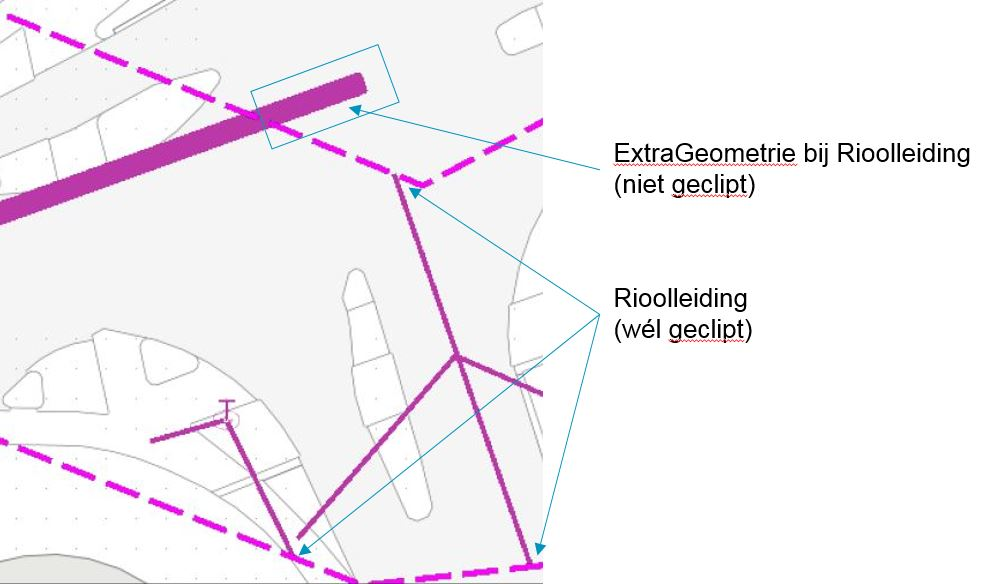

**Bevindingen bij aansluiten netbeheerders**

Sinds het begin van 2019 zijn netbeheerders geleidelijk overgestapt naar een berichtuitwisseling die is gebaseerd op het nieuwe informatiemodel IMKL1.2 en berichtenprotocol BMKL 2.0.  \
Daarbij zijn er door ons fouten en verbeterpunten gevonden die we graag willen delen.  \
Hieronder geven we een overzicht van belangrijke bevindingen, soms aangevuld met aanbevelingen.

- [Aansluitproces van netbeheerders](#aansluitproces-van-netbeheerders)
  * [Autoriseren serviceprovider](#autoriseren-serviceprovider)
  * [Beheren en beoordelen belangen](#beheren-en-beoordelen-belangen)
    - [Belangen van gemeentes](#belangen-van-gemeentes)
  * [Aanvinken van de juiste diensten in "Mijn Kadaster"](#aanvinken-van-de-juiste-diensten-in-mijn-kadaster)
  * [Endpoint netbeheerder](#endpoint-netbeheerder)
    - [Naamgeving endpoint](#naamgeving-endpoint)
    - [PKIoverheid-certificaat](#pkioverheid-certificaat)
  * [Website KLIC](#website-klic)
- [Afwijkingen in xml-gebruik (netinformatie of beheerdersinformatie)](#afwijkingen-in-xml-gebruik-netinformatie-of-beheerdersinformatie)
  * [Datumtijd-notatie](#datumtijd-notatie)
  * [Naamgeving identifiers IMKL- en INSPIRE-features](#naamgeving-identifiers-imkl--en-inspire-features)
  * [Nauwkeurigheid coördinaten (3 decimalen)](#nauwkeurigheid-coordinaten-3-decimalen)
  * [Onnodig gebruik namespace-afkortingen binnen IMKL-features](#onnodig-gebruik-namespace-afkortingen-binnen-imkl-features)
  * [Niet verplichte velden met "lege" waarde](#niet-verplichte-velden-met-lege-waarde)
- [Beperken omvang xml-bestanden (netinformatie of beheerdersinformatie)](#beperken-omvang-xml-bestanden-netinformatie-of-beheerdersinformatie)
  * [Gebruik standaard namespace-afkortingen](#gebruik-standaard-namespace-afkortingen)
  * [Efficienter gebruik _Maatvoering_- en _Annotatie_-objecten](#efficienter-gebruik-maatvoering--en-annotatie-objecten)
    - [Voorkom onnodig gebruik van objecten](#voorkom-onnodig-gebruik-van-objecten)
    - [Specificeer een pijlpunt niet m.b.v. lijnstukken](#specificeer-een-pijlpunt-niet-mbv-lijnstukken)
- [Clippen](#clippen)
  * [Clippen door decentrale netbeheerder](#clippen-door-decentrale-netbeheerder)
  * [Splitsen _UtilityLink_](#splitsen-utilitylink)
  * [Niet geclipte geometrie (centrale netbeheerder)](#niet-geclipte-geometrie-centrale-netbeheerder)
    - [_ExtraGeometrie_ (kabels en leidingen)](#extrageometrie-kabels-en-leidingen)
    - [_ExtraGeometrie_ (mantelbuis)](#extrageometrie-mantelbuis)
    - [_AanduidingEisVoorzorgsmaatregel_ (EV-vlakken)](#aanduidingeisvoorzorgsmaatregel-ev-vlakken)
- [Magere vulling van attributen (datakwaliteit)](#magere-vulling-van-attributen-datakwaliteit)
  * [Gebruik `nilValue` en onbekende waarde](#gebruik-nilvalue-en-onbekende-waarde)
  * [Ontbreken van "echte" waarden](#ontbreken-van-echte-waarden)
- [Spitsvondigheden...](#spitsvondigheden)
  * [Gebruik _ExtraGeometrie_](#gebruik-extrageometrie)
  
- [Bijlagen](#bijlagen)
  * [Bijlage A - Gebruik standaard namespace-afkortingen](#bijlage-a---gebruik-standaard-namespace-afkortingen)
  * [Bijlage B - Voorbeeld met juist gebruik van maatvoering](#bijlage-b---voorbeeld-met-juist-gebruik-van-maatvoering)
  
---------------------------------------------------------
## Aansluitproces van netbeheerders
Om aan te sluiten op het nieuwe informatiemodel en de gegevensuitwisseling volgens BMKL 2.0 moeten door de netbeheerder (of zijn serviceprovider) een aantal stappen worden doorlopen.  \
Op de website van Kadaster KLIC is hierover meer beschreven. Zie [Aansluiten netbeheerder op KLIC-WIN](https://zakelijk.kadaster.nl/aansluiten-bestaande-netbeheerder-op-klic-win).

Op de pagina [KLIC-diensten voor netbeheerders](https://zakelijk.kadaster.nl/klic-diensten-voor-netbeheerders) wordt een toelichting met klantinstructies gegeven over diensten die door de netbeheerder langsgelopen moeten worden om aan te sluiten.

Hieronder staan een aantal punten van aandacht waar netbeheerders tegen aan zijn gelopen.

### Autoriseren serviceprovider
Maakt de netbeheerder gebruik van de diensten van een serviceprovider dan dient de autorisatie voor die betreffende serviceprovider binnen Mijn Kadaster op de juiste manier te zijn ingesteld.

Afhankelijk van de diensten die de serviceprovider mag uitvoeren, moeten verschillende vinkjes worden gezet.  \
Als u overstapt op een andere serviceprovider, moet u de autorisaties voor de oude serviceprovider uitschakelen.

### Beheren en beoordelen belangen
De contactgegevens van een belang moeten worden aangevuld met "Contacten netinformatie" (G/C/O) en "Contact storing/beschadiging". Daarvoor moet eerst een nieuwe **belangversie** worden aangemaakt (op basis van een kopie van een bestaande versie van een productiebelang).  \
Dit is een goed moment om het belanggebied te controleren.  \
Pas als het belang is goedgekeurd (met "Beoordelen belangen") wordt deze in productie genomen.

#### Belangen van gemeentes
Het belanggebied van gemeentes is gelijk aan de gemeentegrens (specifieke gebruikersfunctie in de dienst "Klic Beheren belang").  \
Aan het belang van een gemeente wordt geadviseerd om ook het thema `wees` toe te voegen. Dit maakt het verwerken en beheren van weesleidingen veel eenvoudiger.

### Aanvinken van de juiste diensten in "Mijn Kadaster"
Tijdens het aansluitproces heeft KLIC de juiste diensten voor het klantprofiel van een netbeheerder geactiveerd in "Mijn Kadaster".  \
De netbeheerder moet vervolgens zelf deze diensten aanvinken voor zijn gebruikers. Dit kan Kadaster-KLIC niet doen!  \
In geval van keuze voor centrale voorziening:



### Endpoint netbeheerder

Met de sector is een protocol afgesproken hoe er gecommuniceerd wordt tussen KLIC en de netbeheerders, het zogenaamde BMKL.
Hierbij is aangegeven dat een netbeheerder onverwijld genotificeerd wordt over een gebiedsinformatie-aanvraag waar deze netbeheerder belanghebbend bij is.

Dit protocol is gebaseerd op wetgeving. In het nieuwe BMKL 2.0 is KLIC dus verplicht om de netbeheerder te notificeren als deze belanghebbend is bij een aanvraag.
Hiervoor zal het endpoint door het Kadaster worden aangepast tijdens het aansluiten van de netbeheerder.
Aan het endpoint ("URL") worden eisen gesteld.

Als de netbeheerder wordt genotificeerd, wordt door KLIC niet gecontroleerd of de netbeheerder op dit endpoint bereikbaar is.
Het moment dat een netbeheerder wordt genotificeerd, wordt bij de _BeheerdersinformatieAanvraag_  geregistreerd als `datumGenotificeerd`. 

#### Naamgeving endpoint
Om over te schakelen naar BMKL 2.0 moet een netbeheerder een endpoint opgeven waarop deze genotificeerd moet worden.  \
Dit endpoint moet een syntactisch correct endpoint te zijn.  \
Deze moet beginnen met "http://" of "https://" en worden gevolgd door domeinnaam-locatie.

Voorbeeld: "https://<deze_netbeheerder>.nl/notificatie"

#### PKIoverheid-certificaat
Om als netbeheerder genotificeerd te worden door KLIC, wordt niet (meer) gecontroleerd of deze een geldig PKIoverheid-certificaat heeft.  \
Als een netbeheerder volledig is overgestapt op BMKL 2.0, dan is voor de gegevensuitwisseling met KLIC geen geldig PKIoverheid-certificaat meer nodig.

### Website KLIC

Als alternatief voor het meesturen van algemene of "nietBetrokken" - bijlagen kan de netbeheerder een `website KLIC` opgeven. Dit is een website van de netbeheerder met specifieke informatie voor de Klic-sector.  \
Deze URL wordt opgenomen in de LI.pdf (leveringsbrief) en  de GI.xml (_GebiedsinformatieLevering_). Hiermee kan het aantal bijlage(n) bij een levering worden gereduceerd.

Via de dienst "Klic Beheer communicatie" in het Mijn Kadaster-portaal kunt u als netbeheerder een website KLIC opgeven.  \
De eisen met betrekking tot de in te vullen website KLIC (URL) zijn:
  - moet syntactisch correct zijn
  - moet beginnen met "http://" of "https://"
  - gevolgd door domeinnaam-locatie (host-naam en .nl o.i.d.)

Voorbeeld schermafdruk:


---------------------------------------------------------
## Afwijkingen in xml-gebruik (netinformatie of beheerdersinformatie)

### Datumtijd-notatie
Bij de toepassing van IMKL zijn afspraken gemaakt over de manier waarop datumtijd-velden aangeduid dienen te worden in aangeleverde netinformatie en beheerdersinformatie.  \
Zie daarvoor [Toelichting controles netinformatie KLIC \/ Tijdaanduiding](../Toepassing%20IMKL/Toelichting%20controles%20netinformatie%20KLIC.md#tijdaanduiding).  \
Bij het bundelen van de informatie van alle netbeheerders is er daarmee een eenduidig beeld voor de gebruikers van deze gebiedsinformatie.

Er wordt dringend aanbevolen om deze voorschriften te volgen.

Gebruik dus **NIET** (als voorbeeld)

```xml
    ...
    <net:beginLifespanVersion>2010-10-12T14:36:22.0Z</net:beginLifespanVersion>    <!-- wintertijd 15:36:22 -->
    ...
    <us-net-common:validFrom>2001-06-17T07:30:47Z</us-net-common:validFrom>        <!-- zomertijd 09:30:47 -->
    ...
```
    
maar gebruik **WEL**
```xml
    ...
    <net:beginLifespanVersion>2010-10-12T15:36:22.0+01:00</net:beginLifespanVersion>
    ...
    <us-net-common:validFrom>2001-06-17T09:30:47+02:00</us-net-common:validFrom>
    ...
```

### Naamgeving identifiers IMKL- en INSPIRE-features

In het IMKL-model zijn voorwaarden gesteld aan het format van de identifiers van IMKL-objecten (IMKL- en INSPIRE-features).  \
Zie daarvoor [Hints en tips bij het gebruik van IMKL2015 v1.2.1 \/ Identificaties van objecten](../Toepassing%20IMKL/Hints%20en%20tips%20bij%20gebruik%20van%20IMKL%20v1.2.1.md#identificaties-van-objecten).

Hierbij is aangegeven dat het gebruik van “.” en “-“ niet zomaar is toegestaan.  \
De “-“ is bedoeld om onderscheid te maken tussen:

  * _\<namespace\>_
  * _\<lokaalid\>_
  * _\<versie\>_

De “.” is bedoeld om bij _\<lokaalid\>_ onderscheid te maken tussen

  * _\<bronhoudercode\>_
  * _\<eigen_identificatie_van_bronhouder\>_
  * _\<clip_volgnummer\>_

Dit _\<clip_volgnummer\>_ wordt toegepast bij het splitsen van een _UtilityLink_-feature in meerdere _UtilityLink_-features, ieder met een geclipt deel van de geometrie (zie ook [Clippen](#clippen)).

Het wordt ten sterkste aanbevolen om dit te respecteren en toe te passen, bijvoorbeeld

```xml
    gml:id="nl.imkl-GM9991.RVV-332611"			->    gml:id="nl.imkl-GM9991.RVV_332611"

    <!-- niet opgesplitste UtilityLink -->
    gml:id="nl.imkl-KL9089.datatransport-15.ulink"	->    gml:id="nl.imkl-KL9089.datatransport_15_ulink"
    gml:id="nl.imkl-KL9528.UtilityLink-16"		->    gml:id="nl.imkl-KL9528.UtilityLink_16"

    <!-- wel opgesplitste UtilityLink (versie 1) -->
    gml:id="nl.imkl-KL9089.datatransport8-1.ulink"	->    gml:id="nl.imkl-KL9089.datatransport8_ulink.1"
```

### Nauwkeurigheid coördinaten (3 decimalen)
De geometrie wordt vastgelegd met het RD-coördinatenstelsel (EPSG:28992).  \
RD-coördinaten worden weergegeven in meters met een maximale nauwkeurigheid van 3 decimalen (millimeters).  We verzoeken dringend om coördinaten met deze nauwkeurigheid af te ronden.  \
Zie daarvoor [Toelichting controles netinformatie KLIC \/ Nauwkeurigheid coördinaten](../Toepassing%20IMKL/Toelichting%20controles%20netinformatie%20KLIC.md#nauwkeurigheid-coördinaten).

Gebruik dus **NIET** (als voorbeeld)
```xml
    <net:centrelineGeometry>
        <gml:LineString gml:id="nl.imkl-KL9528.UtilityLink_14_ulink" srsDimension="2" srsName="EPSG:28992">
            <gml:posList>194076.902721317 368144.390100713 194083.012716 368159.638122 ... 193967.744452953 368287.23425146</gml:posList>
        </gml:LineString>
    </net:centrelineGeometry>
```
maar
```xml
    <net:centrelineGeometry>
        <gml:LineString gml:id="nl.imkl-KL9528.UtilityLink_14_ulink" srsDimension="2" srsName="EPSG:28992">
            <gml:posList>194076.903 368144.39 194083.013 368159.638 ... 193967.744 368287.234</gml:posList>
        </gml:LineString>
    </net:centrelineGeometry>
```

### Onnodig gebruik namespace-afkortingen binnen IMKL-features
In de documentatie zijn een aantal werkafspraken gemaakt t.a.v. het gebruik van namespaces en declaraties.  \
Zie daarvoor [Hints en tips bij het gebruik van IMKL2015 v1.2.1 \/ Namespaces en declaraties](../Toepassing%20IMKL/Hints%20en%20tips%20bij%20gebruik%20van%20IMKL%20v1.2.1.md#namespaces-en-declaraties).  \
Daarbij zijn ook afspraken gemaakt over standaard namespace afkortingen.

Het gebruik van deze standaard namespace-afkortingen geeft meerdere voordelen.  \
In [Bijlage A - Gebruik standaard namespace-afkortingen](#bijlage-a---gebruik-standaard-namespace-afkortingen) wordt inzichtelijk gemaakt dat het toepassen hiervan ook een aanzienlijke beperking oplevert van de grootte van de XML-bestanden!

Als bij aanleveringen van een feature-collection aanvullende namespace afkortingen worden gebruikt, worden deze in de verwerking door de centrale voorziening aan elk feature uit de collection toegevoegd.
Het is immers mogelijk dat binnen dit feature gebruik wordt gemaakt van deze namespace afkorting.  \
Daarmee wordt elke feature "opgeblazen" met alle extra genoemde namespace-afkortingen, ongeacht het feit of ze daadwerkelijk worden gebruikt.

Voorbeeld niet-gebruikte namespaces:
```xml
<gml:featureMember>
    <imkl:Appurtenance 
        xmlns:us-govserv="http://inspire.ec.europa.eu/schemas/us-govserv/4.0" 
        xmlns:xs="http://www.w3.org/2001/XMLSchema" 
        xmlns:gn="http://inspire.ec.europa.eu/schemas/gn/4.0" 
        xmlns:gts="http://www.isotc211.org/2005/gts" 
        xmlns:sc="http://www.interactive-instruments.de/ShapeChange/AppInfo" 
        xmlns:gco="http://www.isotc211.org/2005/gco" 
        xmlns:act-core="http://inspire.ec.europa.eu/schemas/act-core/4.0" 
        xmlns:gmd="http://www.isotc211.org/2005/gmd" 
        xmlns:gmlexr="http://www.opengis.net/gml/3.3/exr" 
        xmlns:gsr="http://www.isotc211.org/2005/gsr" 
        xmlns:gss="http://www.isotc211.org/2005/gss" gml:id="nl.imkl-GM9641.763403">
        <net:beginLifespanVersion>2015-03-01T00:00:00.000+01:00</net:beginLifespanVersion>
        <net:inspireId>
            <base:Identifier>
                <base:localId>GM9641.763403</base:localId>
                <base:namespace>nl.imkl</base:namespace>
            </base:Identifier>
        </net:inspireId>
        <net:inNetwork xlink:href="nl.imkl-GM9641.Gemeente_RVV"></net:inNetwork>
        <net:geometry>
            <gml:Point gml:id="nl.imkl-GM9641.763403-0" srsDimension="2" srsName="EPSG:28992">
                <gml:pos>189413.923 350813.441</gml:pos>
            </gml:Point>
        </net:geometry>
        <us-net-common:currentStatus xlink:href="http://inspire.ec.europa.eu/codelist/ConditionOfFacilityValue/functional"></us-net-common:currentStatus>
        ...
        <imkl:bovengrondsZichtbaar>false</imkl:bovengrondsZichtbaar>
    </imkl:Appurtenance>
</gml:featureMember>
```

Het wordt ten sterkste aanbevolen om **GEEN** extra namespace-definiëring te gebruiken als hiervan binnen de feature-collection geen gebruik wordt gemaakt.  \
Het verwijderen van niet gebruikte namespaces leidt niet tot een invalide levering (geen XSD-validatiefouten), maar verhoogt wél de leesbaarheid en beperkt de omvang van de levering.

Als er binnen een feature wél gebruikt wordt gemaakt van een namespace die niet in de standaard lijst staat, kan deze bij dit feature worden gedeclareerd.  \
Zie hiervoor [Hints en tips bij het gebruik van IMKL2015 v1.2.1 \/ Definiering namespaces op dieper niveau](../Toepassing%20IMKL/Hints%20en%20tips%20bij%20gebruik%20van%20IMKL%20v1.2.1.md#definiering-namespaces-op-dieper-niveau).

Voorbeeld eigen namespace:
```xml
<gml:featureMember>
    <imkl:Utiliteitsnet gml:id="nl.imkl-KL3131.UNET_gasHogeDruk_4">
        ...
        <us-net-common:disclaimer >
            <gmd:PT_FreeText xmlns:gmd="http://www.isotc211.org/2005/gmd">
                <gmd:textGroup>
                    <gmd:LocalisedCharacterString>https://www.enexis.nl/Documents/brochures/brochure-graaf-zorgvuldig-klic-noord-en-zuid.pdf</gmd:LocalisedCharacterString>
                </gmd:textGroup>
            </gmd:PT_FreeText>
        </us-net-common:disclaimer>
        ...
    </imkl:Utiliteitsnet>
</gml:featureMember>
```

### Niet verplichte velden met "lege" waarde
We constateren dat er soms attributen van een feature met een "lege" waarde worden meegegeven, terwijl deze attributen als optioneel zijn gedefinieerd in IMKL. Dit lijkt overbodig en onnodig.

Voorbeeld:
```xml
<imkl:Appurtenance gml:id="nl.imkl-GM9641.763403">
    ...
    <us-net-common:utilityFacilityReference/>
    <us-net-common:governmentalServiceReference/>
    ...
</imkl:Appurtenance>
```

---------------------------------------------------------
## Beperken omvang xml-bestanden (netinformatie of beheerdersinformatie)
De wijze waarop volgens het nieuwe IMKL-model gebiedsinformatie wordt uitgewisseld in de KLIC-keten, kan leiden tot omvangrijke xml-bestanden.
De keten is er bij gebaat, als de omvang van deze bestanden kan worden gereduceerd.  \
Hieronder worden een aantal mogelijkheden aangereikt die kunnen leiden tot een beperking van de omvang.

### Gebruik standaard namespace-afkortingen
Zoals al eerder in dit document is aangegeven, zijn een aantal werkafspraken gemaakt t.a.v. het gebruik van namespaces en declaraties.  \
Zie daarvoor [Hints en tips bij het gebruik van IMKL2015 v1.2.1 \/ Namespaces en declaraties](../Toepassing%20IMKL/Hints%20en%20tips%20bij%20gebruik%20van%20IMKL%20v1.2.1.md#namespaces-en-declaraties).

Het toepassen van deze standaard namespace-afkortingen kan leiden tot een aanzienlijke beperking van de grootte van de XML-bestanden!  \
Zie ook [Bijlage A - Gebruik standaard namespace-afkortingen](#bijlage-a---gebruik-standaard-namespace-afkortingen).

### Efficienter gebruik _Maatvoering_- en _Annotatie_-objecten
In het IMKL zijn diverse mogelijkheden aangereikt om _Maatvoering_- en _Annotatie_-objecten te gebruiken.  \
De typering daarvan is aan te geven met het element `maatvoeringsType`, respectievelijk `annotatieType`.
De visualisatie van deze objecten op de kaart is afhankelijk van deze typering. Zie daarvoor de visualisatiebeschrijving bij de laatste versie van het IMKL (zie [IMKL Handreiking visualisatie](https://github.com/Geonovum/imkl2015/tree/master/visualisatie)).

Er zijn netbeheerders die op een ongewenste manier annotaties of maatvoeringen specificeren. Zie uitsnede uit het IMKL: \


#### Voorkom onnodig gebruik van objecten

Uit de visualisatie valt af te leiden, dat er typeringen zijn die een **lijn in combinatie met één of twee pijlpunten** afbeelden. Zie onderstaande situaties.

Het `maatvoeringsType` "**maatvoeringspijl**" visualiseert met één _Maatvoering_-object een lijn ("maatvoerings(hulp)lijn") met beide pijlpunten ("maatvoeringspijlpunt"). Als we de feitelijke maatvoering met een _Maatvoering_-object van het type "maatvoeringslabel" aanduiden, dan neemt het aantal objecten voor deze visualisatie dus af van 4 naar 2! \
Van 4 naar 2 objecten: \



Zie ook [Bijlage B - Voorbeeld met juist gebruik van maatvoering](#bijlage-b---voorbeeld-met-juist-gebruik-van-maatvoering).

Het `annotatieType` "**annotatiepijlEnkelgericht**" visualiseert met één _Annotatie_-object een lijn ("annotatielijn") met één pijlpunt ("annotatiepijlpunt").

Het `annotatieType` "**annotatiepijlDubbelgericht**" visualiseert met één _Annotatie_-object een lijn met beide pijlpunten:

#### Specificeer een pijlpunt niet m.b.v. lijnstukken

Uit de documentatie valt af te leiden, hoe een pijlpunt bij annotatie of maatvoering gevisualiseerd wordt. Hierboven is aangegeven dat wordt aangeraden om daarvoor een type te gebruiken die een lijn in combinatie met één of twee pijlpunten afbeelden. \
In praktijk hebben we voorbeelden aangetroffen dat een pijlpunt is aangeleverd als een lijnstuk met 3 of 4 vertices... \
Dit is onjuist, omdat
- dit een afwijkende visualisatie geeft
- niet gebruik wordt gemaakt van de mogelijkheden om met één object een lijn en pijlpunt(en) te combineren (reductie aantal objecten!)

Onderstaand enkele voorbeelden van een **onjuiste** toepassing:

")


---------------------------------------------------------
## Clippen
Door de kabel- en leidingsector is afgesproken dat er geen geometrie-informatie buiten de graaf- en informatiepolygoon wordt uitgeleverd aan een grondroerder. Daartoe wordt de geometrie ge-"clipt".  \
Voor een uniforme afhandeling zal zowel de centrale voorziening, als netbeheerders die decentraal blijven aanleveren, moeten clippen.  \
Zie ook de presentatie [Uitleveren \/ Clippen](../Uitleveren/25-04-10%20Clippen.pptx).

### Clippen door decentrale netbeheerder
Ook van een decentrale netbeheerder wordt verwacht dat deze geen informatie aanlevert buiten het geselecteerde gebied van de aanvraag.  \
De geometrie moet dus **OOK** door de decentrale netbeheerder worden geclipt.

### Splitsen _UtilityLink_
Een _UtilityLink_ is een INSPIRE-feature en kent een attribuut `centrelineGeometry` van het type `GM_Curve` (lijn).  \
Van dit type staan we het gebruik van `gml:LineString`  of `gml:Curve` toe.

Voorbeeld:
```xml
<gml:LineString gml:id="nl.imkl-KL9999.W_ls118334_geo" srsDimension="2" srsName="EPSG:28992">
    <gml:posList>154430.283 389769.995 154431.859 389767.832 154430.610 389766.544</gml:posList>
</gml:LineString>
```

Het clippen van deze geometrie zou mogelijk leiden tot een `GM_MultiCurve` (multilijn), maar dat wordt door de typering van het `centrelineGeometry`-attribuut niet toegestaan.  \
Er is er daarom voor gekozen om in dat geval een oorspronkelijk _UtilityLink_-object op te splitsen in twee of meer _UtilityLink_-objecten, ieder met een eigen deel van de (geclipte) geometrie.

Aan de _UtlityLink_’s die daaruit ontstaan, is aan de oorspronkelijke gml-identificatie een volgnummer toegevoegd (te beginnen met volgnummer 1) en gescheiden door een “.”.  \
Het feature met een verwijzing naar de oorspronkelijke _UtilityLink_ is ook aangepast, zodat naar beide aangepaste _UtilityLink_’s wordt verwezen (zie feature imkl:Waterleiding).

Voorbeeld van een "gesplitste" _UtilityLink_ bij een waterleiding:
```xml
<gml:featureMember>
    <imkl:Waterleiding gml:id="nl.imkl-KL9999.WL_00287">
        ...
        <net:link xlink:href="nl.imkl-KL9999.WL_00287_ulink.1"/>
        <net:link xlink:href="nl.imkl-KL9999.WL_00287_ulink.2"/>
        ...
    </imkl:Waterleiding>
</gml:featureMember>
<gml:featureMember>
    <us-net-common:UtilityLink gml:id="nl.imkl-KL9999.WL_00287_ulink.1">
        <net:beginLifespanVersion>2001-12-17T09:30:47.00+01:00</net:beginLifespanVersion>
        <net:inspireId>
            <base:Identifier>
                <base:localId>KL9999.WL_00287_ulink.1</base:localId>
                <base:namespace>nl.imkl</base:namespace>
            </base:Identifier>
        </net:inspireId>
        ...
        <net:centrelineGeometry>
            <gml:LineString gml:id="idm522347457968.1" srsDimension="2" srsName="EPSG:28992">
                <gml:posList>155475.0 392260.0 155512.5 392335.0</gml:posList>
            </gml:LineString>
        </net:centrelineGeometry>
        ...
    </us-net-common:UtilityLink>
</gml:featureMember>
<gml:featureMember>
    <us-net-common:UtilityLink gml:id="nl.imkl-KL9999.WL_00287_ulink.2">
        <net:beginLifespanVersion>2001-12-17T09:30:47.00+01:00</net:beginLifespanVersion>
        <net:inspireId>
            <base:Identifier>
                <base:localId>KL9999.WL_00287_ulink.2</base:localId>
                <base:namespace>nl.imkl</base:namespace>
            </base:Identifier>
        </net:inspireId>
        ...
        <net:centrelineGeometry>
            <gml:LineString gml:id="idm522347457968.2" srsDimension="2" srsName="EPSG:28992">
                <gml:posList>155526.25 392335.0 155557.5 392260.0</gml:posList>
            </gml:LineString>
        </net:centrelineGeometry>
        ...
    </us-net-common:UtilityLink>
</gml:featureMember>
```

Visualisatievoorbeeld van "gesplitste" _UtilityLink_'s bij _Telecommunicatiekabel_'s:
.jpg "Gesplitste UtilityLink´s (datatransport)")

## Niet geclipte geometrie (centrale netbeheerder)
Voor de features _AanduidingEisVoorzorgsmaatregel_ en _ExtraGeometrie_ zijn volgens het huidige IMKL geen multigeometrieën toegestaan.  \
Omdat dit wél gewenste functionaliteit is voor het clippen van een vlak-geometrie, worden deze features (nu) niet geclipt.  \
Zie issue 210: Geonovum, [Gebruik multi-geometrieën bij AanduidingEisVoorzorgzorgsmaatregel en ExtraGeometrie](https://github.com/Geonovum/imkl2015-review/issues/210).

### _ExtraGeometrie_ (kabels en leidingen)
Van het object _ExtraGeometrie_ ondersteunen we momenteel alleen het attribuut `vlakgeometrie2D`, van het type `GM_Surface`.  \
Omdat het clippen van deze geometrie mogelijk tot een `GM_MultiSurface` zou kunnen leiden, wordt er (nu) niet geclipt.

Een _ExtraGeometrie_-vlak bij een kabel of leiding wordt vlakvullend gevisualiseerd volgens de kleur van het kabel- of leidingelement waartoe deze behoort.  \
Omdat _ExtraGeometrie_-objecten (nog) niet geclipt worden, zijn deze als "dikke" leidingen ook buiten het graafgebied zichtbaar.

### _ExtraGeometrie_ (mantelbuis)
Binnen het graafgebied wordt een mantelbuis als een wit vlak met een buitenrand gevisualiseerd volgens de kleur van het utiliteitsnet waartoe de mantelbuis behoort.
Een _ExtraGeometrie_-vlak bij mantelbuis wordt vlakvullend gevisualiseerd eveneens volgens de kleur van het utiliteitsnet bij de mantelbuis.  \
De standaard visualisatie van een mantelbuis en de visualisatie van het extra vlak overlappen elkaar.

Ook deze _ExtraGeometrie_-objecten worden (nog) niet geclipt worden, zijn deze als "mantelbuis-vlak" ook buiten het graafgebied zichtbaar.
Dit geeft visueel rare "verlengingen" van de mantelbuis.  \
NB. De huidige Klic-viewer selecteert met de "i"-knop geen ExtraGeometrie-objecten. Deze objecten zijn buiten de polygoon dus niet "clickable".

Voorbeeld:
```xml
<gml:featureMember>
    <imkl:Mantelbuis gml:id="nl.imkl-GM9599.ls_239694">
        ...
        <net:link xlink:href="nl.imkl-GM9599.239694"></net:link>
        ...
        <imkl:extraGeometrie xlink:href="nl.imkl-GM9599.ls_239694_extra"></imkl:extraGeometrie>
        ...
    </imkl:Mantelbuis>
</gml:featureMember>
<gml:featureMember>
    <imkl:ExtraGeometrie gml:id="nl.imkl-GM9599.ls_239694_extra">
        ...
        <imkl:vlakgeometrie2D>
            <gml:Polygon gml:id="id-8a014baf-dc93-4caf-87aa-2b943180343e-0" srsDimension="2" srsName="EPSG:28992">
                <gml:exterior>
                    <gml:LinearRing>
                        <gml:posList>93337.853 435847.548 93344.755 435843.951 93344.939 435844.305 93338.037 435847.902 93337.853 435847.548</gml:posList>
                    </gml:LinearRing>
                </gml:exterior>
            </gml:Polygon>
        </imkl:vlakgeometrie2D>
        ...
    </imkl:ExtraGeometrie>
</gml:featureMember>
```

### _AanduidingEisVoorzorgsmaatregel_ (EV-vlakken)
Een _AanduidingEisVoorzorgsmaatregel_-object heeft (nu) een geometrie van het type `GM_Surface`.  \
Omdat het clippen van deze geometrie mogelijk tot een `GM_MultiSurface` zou kunnen leiden, wordt er (nu) niet geclipt.

---------------------------------------------------------
## Magere vulling van attributen (datakwaliteit)

### Gebruik `nilValue` en onbekende waarde
Voorbeelden:
```xml
    <us-net-common:warningType xsi:nil="true" nilReason="http://inspire.ec.europa.eu/codelist/VoidReasonValue/Unknown"></us-net-common:warningType>
    ...
    <us-net-common:warningType xsi:nil="true" nilReason="http://inspire.ec.europa.eu/codelist/VoidReasonValue/Unpopulated"></us-net-common:warningType>
```

### Ontbreken van "echte" waarden
Voorbeelden:
```xml
    ...
    <imkl:geoNauwkeurigheidXY xlink:href="http://definities.geostandaarden.nl/imkl2015/id/waarde/NauwkeurigheidXYvalue/onbekend"></imkl:geoNauwkeurigheidXY>
    ...
    <imkl:kabelDiameter uom="urn:ogc:def:uom:OGC::mm">0.0</imkl:kabelDiameter>
    ...
    <us-net-common:pipeDiameter uom="urn:ogc:def:uom:OGC::mm">0.0</us-net-common:pipeDiameter>
    ...
    <us-net-el:operatingVoltage uom="urn:ogc:def:uom:OGC::V">0</us-net-el:operatingVoltage>
    <us-net-el:nominalVoltage uom="urn:ogc:def:uom:OGC::V">0</us-net-el:nominalVoltage>
    ...
    <imkl:buismateriaalType xlink:href="http://definities.geostandaarden.nl/imkl2015/id/waarde/PipeMaterialTypeIMKLValue/onbekend"></imkl:buismateriaalType>
    ...
```
Een _Rioolleiding_ behorend bij een `rioolOnderOverOfOnderdruk` zonder druk:
```xml
<imkl:Rioolleiding gml:id="nl.imkl-GM0599.rod_185649">
    ...
    <us-net-common:pipeDiameter uom="urn:ogc:def:uom:OGC::cm">1.048</us-net-common:pipeDiameter>
    <us-net-common:pressure uom="urn:ogc:def:uom:OGC::bar">0</us-net-common:pressure>
    ...
```  

---------------------------------------------------------
## Spitsvondigheden...
Bij het steekproefsgewijs doornemen of toetsen van aangeleverde netinformatie of beheerdersinformatie zijn we tegen verrassende implementatiekeuzes van netbeheerders aangelopen.

### Gebruik _ExtraGeometrie_
Bij enkele beheerders van rioolleidingen is aan (elk) _Rioolleiding_-object een object gekoppeld van het type _ExtraGeometrie_ (vlak, attribuuttype `GM_Surface`).  \
In de visualisatie is de rioolleiding daardoor zichtbaar als een dikke leiding (vlakvullend).  \
Omdat _ExtraGeometrie_-objecten (nog) niet geclipt worden (zie hierboven), zijn deze dikke leidingen ook buiten het graafgebied zichtbaar.

Zie onderstaand voorbeeld met het effect voor visualisatie: \


---------------------------------------------------------
## Bijlagen

### Bijlage A - Gebruik standaard namespace-afkortingen
Hieronder is een voorbeeld uit een productielevering met **onjuist** gebruik van namespace-afkortingen:
```xml
<gml:featureMember>
  <imkl:Appurtenance gml:id="nl.imkl-KL8851.19954798_200" xmlns:imkl="http://www.geostandaarden.nl/imkl/2015/wion/1.2">
    <net:beginLifespanVersion xmlns:net="http://inspire.ec.europa.eu/schemas/net/4.0">1900-01-01T01:00:00</net:beginLifespanVersion>
    <net:inspireId xmlns:net="http://inspire.ec.europa.eu/schemas/net/4.0">
      <base:Identifier xmlns:base="http://inspire.ec.europa.eu/schemas/base/3.3">
        <base:localId>KL8851.19954798_200</base:localId>
        <base:namespace>nl.imkl</base:namespace>
      </base:Identifier>
    </net:inspireId>
    <net:inNetwork n1:href="nl.imkl-KL8851.geulen" xmlns:n1="http://www.w3.org/1999/xlink" xmlns:net="http://inspire.ec.europa.eu/schemas/net/4.0" />
    <net:geometry xmlns:net="http://inspire.ec.europa.eu/schemas/net/4.0">
      <gml:Point srsName="EPSG:28992" gml:id="geomid.nl.imkl.KL8851.19954798_200">
        <gml:pos srsDimension="2">132733.934 399531.492</gml:pos>
      </gml:Point>
    </net:geometry>
    <us-net-common:currentStatus n1:href="http://inspire.ec.europa.eu/codelist/ConditionOfFacilityValue/functional" xmlns:n1="http://www.w3.org/1999/xlink" xmlns:us-net-common="http://inspire.ec.europa.eu/schemas/us-net-common/4.0" />
    <us-net-common:validFrom nilReason="http://inspire.ec.europa.eu/codelist/VoidReasonValue/Unknown" xsi:nil="true" xmlns:xsi="http://www.w3.org/2001/XMLSchema-instance" xmlns:us-net-common="http://inspire.ec.europa.eu/schemas/us-net-common/4.0" />
    <us-net-common:validTo nilReason="http://inspire.ec.europa.eu/codelist/VoidReasonValue/Unknown" xsi:nil="true" xmlns:xsi="http://www.w3.org/2001/XMLSchema-instance" xmlns:us-net-common="http://inspire.ec.europa.eu/schemas/us-net-common/4.0" />
    <us-net-common:verticalPosition nilReason="http://inspire.ec.europa.eu/codelist/VoidReasonValue/Unknown" xsi:nil="true" xmlns:xsi="http://www.w3.org/2001/XMLSchema-instance" xmlns:us-net-common="http://inspire.ec.europa.eu/schemas/us-net-common/4.0" />
    <us-net-common:utilityFacilityReference xsi:nil="true" nilReason="http://inspire.ec.europa.eu/codelist/VoidReasonValue/Unknown" xmlns:xsi="http://www.w3.org/2001/XMLSchema-instance" xmlns:us-net-common="http://inspire.ec.europa.eu/schemas/us-net-common/4.0" />
    <us-net-common:governmentalServiceReference xsi:nil="true" nilReason="http://inspire.ec.europa.eu/codelist/VoidReasonValue/Unknown" xmlns:xsi="http://www.w3.org/2001/XMLSchema-instance" xmlns:us-net-common="http://inspire.ec.europa.eu/schemas/us-net-common/4.0" />
    <us-net-common:appurtenanceType n1:href="http://definities.geostandaarden.nl/imkl2015/id/waarde/TelecommunicationsAppurtenanceTypeIMKLValue/GTWP" xmlns:n1="http://www.w3.org/1999/xlink" xmlns:us-net-common="http://inspire.ec.europa.eu/schemas/us-net-common/4.0" />
  </imkl:Appurtenance>
</gml:featureMember>
```
Omdat de namespaces 
```xml
    xmlns:imkl="http://www.geostandaarden.nl/imkl/2015/wion/1.2"
    xmlns:xsi="http://www.w3.org/2001/XMLSchema-instance" 
    xmlns:xlink="http://www.w3.org/1999/xlink" 
    xmlns:net="http://inspire.ec.europa.eu/schemas/net/4.0" 
    xmlns:base="http://inspire.ec.europa.eu/schemas/base/3.3" 
    xmlns:us-net-common="http://inspire.ec.europa.eu/schemas/us-net-common/4.0" 
```
al binnen de KLIC-levering zijn gedefinieerd, moeten ze binnen de elementen **NIET OPNIEUW** worden gedefinieerd.  \
Dit leidt tot onderstaande vereenvoudiging:
```xml
<gml:featureMember>
  <imkl:Appurtenance gml:id="nl.imkl-KL8851.19954798_200">
    <net:beginLifespanVersion>1900-01-01T01:00:00</net:beginLifespanVersion>
    <net:inspireId>
      <base:Identifier>
        <base:localId>KL8851.19954798_200</base:localId>
        <base:namespace>nl.imkl</base:namespace>
      </base:Identifier>
    </net:inspireId>
    <net:inNetwork xlink:href="nl.imkl-KL8851.geulen"/>
    <net:geometry>
      <gml:Point srsName="EPSG:28992" gml:id="geomid.nl.imkl.KL8851.19954798_200">
        <gml:pos srsDimension="2">132733.934 399531.492</gml:pos>
      </gml:Point>
    </net:geometry>
    <us-net-common:currentStatus xlink:href="http://inspire.ec.europa.eu/codelist/ConditionOfFacilityValue/functional"/>
    <us-net-common:validFrom nilReason="http://inspire.ec.europa.eu/codelist/VoidReasonValue/Unknown" xsi:nil="true"/>
    <us-net-common:validTo nilReason="http://inspire.ec.europa.eu/codelist/VoidReasonValue/Unknown" xsi:nil="true"/>
    <us-net-common:verticalPosition nilReason="http://inspire.ec.europa.eu/codelist/VoidReasonValue/Unknown" xsi:nil="true"/>
    <us-net-common:utilityFacilityReference xsi:nil="true" nilReason="http://inspire.ec.europa.eu/codelist/VoidReasonValue/Unknown"/>
    <us-net-common:governmentalServiceReference xsi:nil="true" nilReason="http://inspire.ec.europa.eu/codelist/VoidReasonValue/Unknown"/>
    <us-net-common:appurtenanceType xlink:href="http://definities.geostandaarden.nl/imkl2015/id/waarde/TelecommunicationsAppurtenanceTypeIMKLValue/GTWP"/>
  </imkl:Appurtenance>
</gml:featureMember>
```
NB. De datakwaliteit in bovenstaand voorbeeld is nu buiten beschouwing gelaten...


### Bijlage B - Voorbeeld met juist gebruik van maatvoering
Hieronder is een voorbeeld op basis van een productielevering met juist gebruik van _Maatvoering_-objecten:

```xml
<gml:featureMember>
<imkl:Maatvoering gml:id="nl.imkl-KL8881.MAAT_G_Header_LD_1_31046155">
	<imkl:identificatie>
		<imkl:NEN3610ID>
			<imkl:namespace>nl.imkl</imkl:namespace>
			<imkl:lokaalID>KL8881.MAAT_G_Header_LD_1_31046155</imkl:lokaalID>
		</imkl:NEN3610ID>
	</imkl:identificatie>
	<imkl:beginLifespanVersion>2019-06-19T13:15:06+02:00</imkl:beginLifespanVersion>
	<imkl:inNetwork xlink:href="nl.imkl-KL8881.UNET_oilGasChemicalsGLD_5"></imkl:inNetwork>
	<imkl:maatvoeringsType xlink:href="http://definities.geostandaarden.nl/imkl2015/id/waarde/MaatvoeringsTypeValue/maatvoeringspijl"></imkl:maatvoeringsType>
	<imkl:ligging>
		<gml:LineString srsName="urn:ogc:def:crs:EPSG::28992" gml:id="MAAT_G_Header_LD_1_31046155_1_GeoSeq_1">
			<gml:posList>56466.359 427599.278 56463.776 427597.732</gml:posList>
		</gml:LineString>
	</imkl:ligging>
</imkl:Maatvoering>
</gml:featureMember>

<gml:featureMember>
<imkl:Maatvoering gml:id="nl.imkl-KL8881.MAAT_G_Label_LD_1_51310894">
	<imkl:identificatie>
		<imkl:NEN3610ID>
			<imkl:namespace>nl.imkl</imkl:namespace>
			<imkl:lokaalID>KL8881.MAAT_G_Label_LD_1_51310894</imkl:lokaalID>
		</imkl:NEN3610ID>
	</imkl:identificatie>
	<imkl:beginLifespanVersion>2019-06-19T13:15:06+02:00</imkl:beginLifespanVersion>
	<imkl:label> 3.0 </imkl:label>
	<imkl:inNetwork xlink:href="nl.imkl-KL8881.UNET_oilGasChemicalsGLD_5"></imkl:inNetwork>
	<imkl:maatvoeringsType xlink:href="http://definities.geostandaarden.nl/imkl2015/id/waarde/MaatvoeringsTypeValue/maatvoeringslabel"></imkl:maatvoeringsType>
	<imkl:rotatiehoek uom="urn:ogc:def:uom:OGC::deg">59</imkl:rotatiehoek>
	<imkl:labelpositie>
		<imkl:Labelpositie>
			<imkl:aangrijpingHorizontaal xlink:href="http://definities.geostandaarden.nl/imkl2015/id/waarde/LabelpositieValue/1"></imkl:aangrijpingHorizontaal>
			<imkl:aangrijpingVerticaal xlink:href="http://definities.geostandaarden.nl/imkl2015/id/waarde/LabelpositieValue/1"></imkl:aangrijpingVerticaal>
		</imkl:Labelpositie>
	</imkl:labelpositie>
	<imkl:ligging>
		<gml:Point srsName="urn:ogc:def:crs:EPSG::28992" gml:id="MAAT_G_Label_LD_1_51310894_1_GeoSeq_1">
			<gml:pos>56465.667 427598.697</gml:pos>
		</gml:Point>
	</imkl:ligging>
</imkl:Maatvoering>
</gml:featureMember>
```
