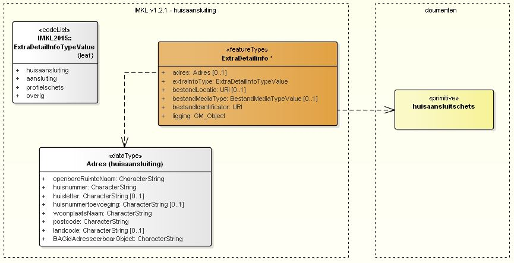

# Gebruik huisaansluitschetsen in IMKL v1.2.1

**Inhoudsopgave**

- [Aanpassingen IMKL](#aanpassingen-imkl)
- [Implementatie in huidige KLIC-omgeving](#implementatie-in-huidige-klic-omgeving)

---------------------------------------------------------
## Aanpassingen IMKL

Volgens het nieuwe IMKL v1.2.1 (zie [dataspecificatie IMKL v1.2.1](http://register.geostandaarden.nl/informatiemodel/imkl2015/1.2.1/IMKL2015_Dataspecificatie_1.2.1.pdf)) wordt een huisaansluiting gespecificeerd door _ExtraDetailinfo_ van het type `huisaansluiting` met een verwijzing naar een _Adres_ en een verwijzing naar het PDF-document met de huisaansluitschets.  \
Zie onderstaande schematische weergave:

_Figuur 1 Gebruik "huisaansluitschets" in IMKL v1.2.1_

Omdat ook KLIC aansluit op de wettelijke basisregistratie BAG, moet dit adres in de basisregistratie BAG bestaan.
In IMKL v1.2.1 is afgesproken dat voor de **unieke identificatie** van een huisaansluiting het BAG ID van het “adresseerbare object” wordt gebruikt (`BAGidAdresseerbaarObject`).
De soorten adresseerbare objecten zijn
-	Verblijfsobject
-	Ligplaats
-	Standplaats

Bij het aanleveren van huisaansluitschetsen volgens het nieuwe IMKL moet dus de volgende gegevens worden meegeleverd (zie \<\<dataType\>\> **Adres (huisaansluiting)**):
-	openbareRuimteNaam
-	huisnummer
-	huisletter (optioneel)
-	huisnummertoevoeging (optioneel)
-	woonplaatsNaam
-	postcode
-	landcode (optioneel)
-	BAGidAdresseerbaarObject

Dit geldt zowel voor de
-	centrale netbeheerder: bij aanlevering van netinformatie aan de Centrale Voorziening
-	decentrale netbeheerder: bij aanlevering van beheerdersinformatie en huisaansluitschetsen volgens het nieuwe berichtenmodel BMKL 2.0

Alle ‘_ExtraDetailinfo_’-objecten van het type `huisaansluiting` moeten dan voorzien zijn van het BAG-ID van het Adresseerbaar Object.

---------------------------------------------------------
## Implementatie in huidige KLIC-omgeving

Met de invoering van de bovengenoemde functionaliteit per medio november 2018 wordt de voorbereiding getroffen voor de implementatie van het nieuwe IMKL v1.2.1 (per 1 januari 2019).

Vanaf dat moment (dus medio november 2018) kunnen door grondroerders alleen nog maar huisaansluitschetsen van adresseerbare objecten worden opgevraagd.  \
Zie voor meer details het overzicht van [geplande werkzaamheden](../(KLIC%20-%20Geplande%20werkzaamheden.md).

	** **
	**Bent u al voorbereid op deze nieuwe manier van aanvragen en aanleveren van huisaansluitschetsen?**
	** **